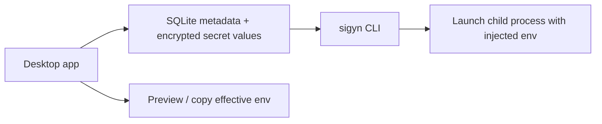

# sigyn

Local-first macOS desktop app and companion CLI for managing project-specific environment configurations from an encrypted local store.

> **Status:** early-stage project. APIs, UX, and storage details may change before a stable public release.

## Overview

sigyn is built for a single developer working locally on macOS. It keeps secret values encrypted at rest, lets you assemble an effective environment from saved presets and overrides, and can launch commands with injected variables without writing a plaintext `.env` file.



## Features

- multiple saved projects
- project-specific supported environments such as `local`, `dev`, `staging`, and `prod`
- per-entry values by environment
- mixed presets through per-entry overrides (base env + per-entry overrides from other envs)
- preview and clipboard export of the effective env
- CLI execution with injected environment variables
- macOS device authentication before secret access

## Current Scope

- macOS only
- local-first and single-user
- desktop app plus bundled CLI
- encrypted secret values stored locally
- Touch ID with device-password fallback through macOS LocalAuthentication

## Install From Source

`install.sh` is the current install path for source builds. It installs the app into `/Applications` and symlinks the CLI into `~/.local/bin`. Running it again performs an update, overwriting the previous app, but does not overwrite any data.

Prerequisites:

- macOS
- Node.js and npm
- Rust toolchain
- Xcode or Command Line Tools
- accepted Xcode license

Run:

```sh
./install.sh
```

Skip rebuilding and install from existing release artifacts:

```sh
./install.sh --no-build
```

After installation:

- launch `sigyn` from `/Applications` or Spotlight
- run `sigyn --help` from a terminal

**Keychain access:** On first launch, macOS will prompt you to allow sigyn to access the keychain. Choose **Always Allow** so you are not reprompted on every run. The app only accesses its own encryption key from the keychain. You will be reprompted after each new install or update.

## Build Manually

Install JavaScript dependencies:

```sh
npm install
```

Build a local release bundle:

```sh
CARGO_HOME="$PWD/.cargo-home" \
CARGO_TARGET_DIR="$PWD/build/tauri-target" \
CI=false \
npm run tauri:build
```

Open the built app:

```sh
open "build/tauri-target/release/bundle/macos/sigyn.app"
```

If you have a real Apple signing certificate installed, export `APPLE_SIGNING_IDENTITY` before building. Otherwise the repo falls back to ad-hoc signing for local builds.

## Development

Start the live-reload Tauri app:

```sh
npm install
```

```sh
CARGO_HOME="$PWD/.cargo-home" \
CARGO_TARGET_DIR="$PWD/build/tauri-target" \
CI=false \
npm run tauri:dev
```

Useful checks:

```sh
npm run build
```

```sh
CARGO_HOME="$PWD/.cargo-home" \
CARGO_TARGET_DIR="$PWD/build/tauri-target" \
cargo check --manifest-path src-tauri/Cargo.toml
```

## Quick Start

1. Launch the app and click `Unlock`.
2. Create a project such as `retail-service`.
3. Enter supported environments such as `local, dev, staging, prod`.
4. Optionally set a default working directory for CLI runs.
5. Add entries such as `DATABASE_URL`, `API_TOKEN`, and `REDIS_URL`.
6. Fill values per environment.
7. Choose a base environment.
8. Optionally override individual entries to pull values from other envs (e.g. base `local` with `DATABASE_URL` from `staging`).
9. Preview or copy the effective env. When you run `sigyn run` or `sigyn preview`, the injected env reflects this mix.

## CLI

The bundled CLI binary is included inside the built app bundle at:

- `build/tauri-target/release/bundle/macos/sigyn.app/Contents/MacOS/sigyn`

Omit `--project` to use the project selected in the desktop app.

Examples:

```sh
sigyn list
```

```sh
sigyn preview
```

```sh
sigyn uv run python -m retail_service
```

With explicit project:

```sh
sigyn preview --project "retail-service"
```

```sh
sigyn run --project "retail-service" -- uv run python -m retail_service
```

**Mix and match envs:** You can use a base environment (e.g. `local`) and override specific entries to pull values from other envs (e.g. `DATABASE_URL` from `staging`). The app and CLI both use this effective mix when previewing or running commands.

Behavior:

- authenticates locally through macOS before decrypting secrets
- reads the same local store as the desktop app
- injects env vars directly into the child process
- does not write a `.env` file
- inherits the parent shell environment and then adds or overrides project variables

For destructive local cleanup during development:

```sh
sigyn reset-test-data --confirm "delete all data"
```

Quit the desktop app before running `reset-test-data`.

## Security

sigyn encrypts secret values before storing them locally and keeps the master key in macOS Keychain.

Important limits:

- only secret values are encrypted
- project names, entry names, descriptions, and environment labels remain plaintext
- there is no built-in sync, sharing, recovery, or key rotation yet

See `SECURITY.md` for the full threat model and implementation details.

## Documentation

- `docs/architecture.md`
- `SECURITY.md`

## Project Layout

- `src/`: React frontend
- `src/lib/`: frontend Tauri invoke client and shared types
- `src-tauri/src/`: Rust runtime, CLI, auth, IPC, and store logic
- `docs/`: project documentation
- `install.sh`: source install workflow
