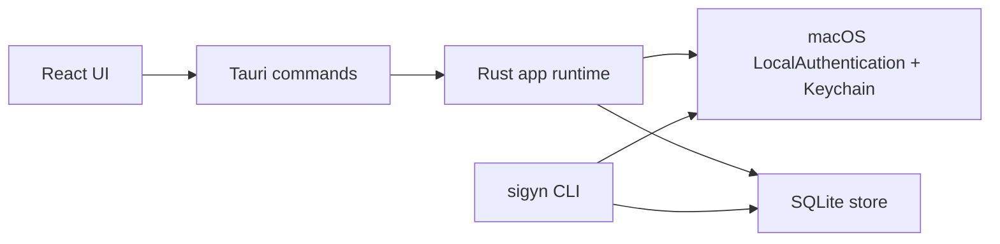
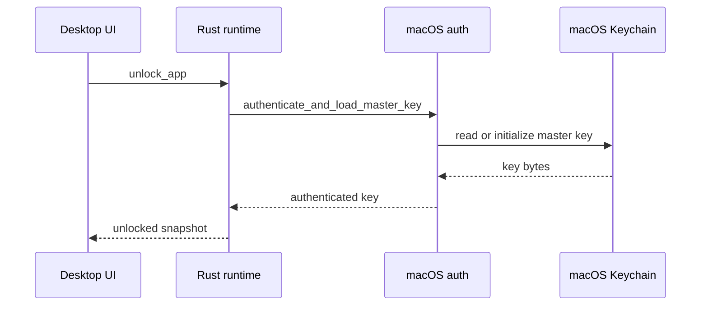
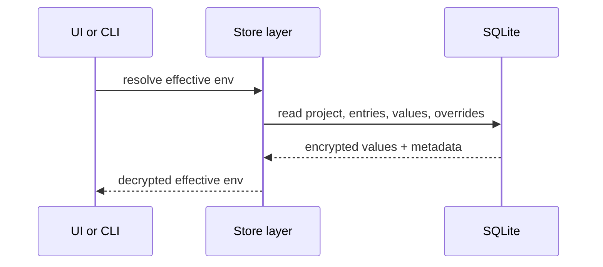

# Architecture

This document summarizes the current structure of sigyn and the main data flows between the desktop UI, the local store, and the CLI.

## High-Level Shape

## Main Components

### Frontend

- Path: `src/`
- Stack: React + TypeScript + Vite
- Responsibilities:
  - render project, environment, and entry management UI
  - request snapshots and mutations through Tauri commands
  - manage transient UI state such as search, dialogs, previews, and notices
  - trigger auto-lock behavior when the app is idle or hidden

### Desktop Runtime

- Path: `src-tauri/src/lib.rs`
- Responsibilities:
  - expose Tauri commands to the frontend
  - manage the in-memory unlocked session
  - zeroize cached key material on lock or idle expiry
  - emit snapshot updates back to the frontend
  - own tray and app-lifecycle integration

### Store Layer

- Path: `src-tauri/src/store.rs`
- Responsibilities:
  - initialize and access the local SQLite database
  - create, update, and delete projects and entries
  - encrypt and decrypt entry values
  - resolve effective environments for preview and CLI execution
  - enforce filesystem permissions on the data directory and database

### macOS Authentication

- Paths: `src-tauri/src/macos_auth.rs`, platform-specific dependencies in `src-tauri/Cargo.toml`
- Responsibilities:
  - prompt for device-owner authentication through macOS LocalAuthentication
  - load or initialize the master key in macOS Keychain
  - keep the trust boundary anchored in the operating system rather than in app-managed passwords

### CLI

- Paths: `src-tauri/src/cli.rs`, `src-tauri/src/bin/sigyn.rs`
- Responsibilities:
  - list projects
  - preview the effective environment for a project
  - launch a child process with injected environment variables
  - perform destructive local reset during development

## Data Model

sigyn stores:

- projects
- supported environments per project
- entries keyed by environment-variable name
- per-environment entry values
- the locally selected active project
- per-entry override selections

Only secret values are encrypted. Project names, entry names, descriptions, categories, and environment labels remain plaintext metadata in SQLite.

## Unlock Flow

Notes:

- the runtime keeps the key only in memory while unlocked
- the session expires after inactivity
- key bytes are zeroized when the session is cleared

## Preview And Run Flow

The desktop UI uses the resolved result for preview and copy. The CLI uses it to inject variables into a child process without writing a `.env` file.

## Repository Layout

- `src/`: frontend UI
- `src/lib/`: frontend invoke client and shared types
- `src-tauri/src/`: Rust runtime, CLI, store, auth, IPC, and models
- `src-tauri/tauri.conf.json`: Tauri bundle and app configuration
- `install.sh`: source install workflow
- `SECURITY.md`: threat model and security details

## Current Constraints

- macOS only
- single-user and local-first
- no built-in sync or collaboration
- no key rotation or recovery workflow yet
- no formal automated test suite yet

These constraints are intentional for the current project stage and should be considered when proposing larger architectural changes.
